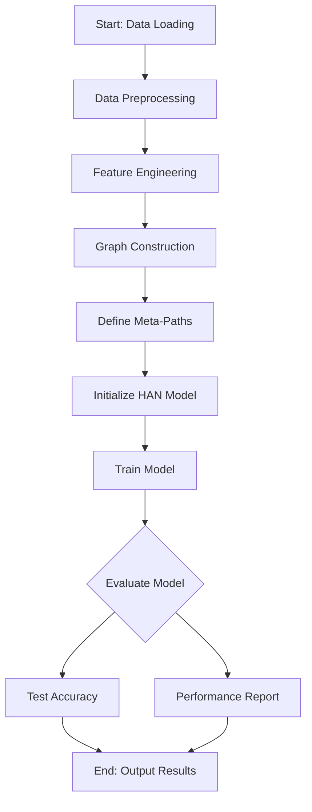
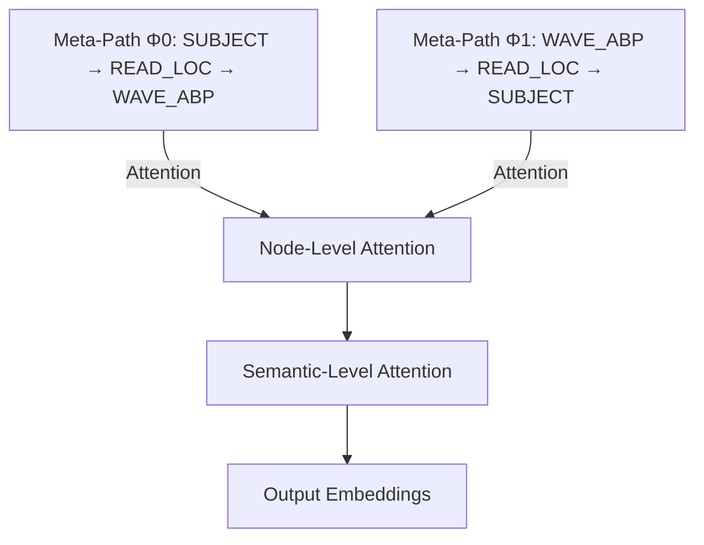
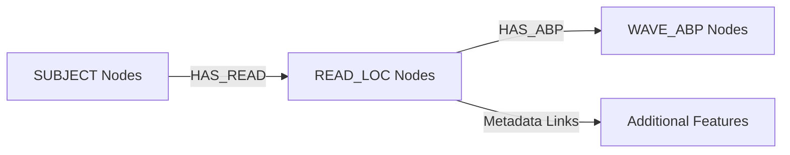

# BNN-HAN-POC

Heterogeneous Graph Attention Network (HAN) Proof-of-Concept for EEG-Based Chronic Pain Detection

## Abstract

This project introduces a novel approach to chronic pain detection leveraging electroencephalographic (EEG) biomarkers. By utilizing a Heterogeneous Graph Attention Network (HAN), the BNN-HAN framework integrates brain topology with EEG channel reads and features such as Absolute Band Power (ABP). Initial findings demonstrate the framework's potential in improving chronic pain detection through a resource-efficient, data-driven methodology.

## OSF Project

[BNN-HAN-POC on OSF](https://osf.io/z63jw/?view_only=d68a9e47582b44ccb816c29dcf206e5e)

## Background

Chronic pain is a prevalent and debilitating condition that affects millions globally. The subjective nature of chronic pain assessment, typically reliant on self-reported measures, poses challenges in diagnosis and treatment. To address these limitations, this project leverages EEG biomarkers, such as Absolute Band Power (ABP), which provide objective, quantifiable insights into brain activity patterns associated with chronic pain.

Absolute Band Power measures brain wave activity across frequency bands (Delta, Theta, Alpha, Beta, Gamma) and has been shown to correlate with chronic pain states. By integrating ABP data with brain topology using a graph-based approach, this project aims to identify distinct neural patterns and classify chronic pain states effectively.

The BNN-HAN framework employs a Heterogeneous Graph Attention Network (HAN) to analyze EEG-derived graphs, enabling the extraction of meaningful features from complex brain activity patterns. This approach not only enhances the accuracy of pain detection but also provides a scalable and resource-efficient solution for clinical applications.

[EEG-Pain-BioMarker.discovery-graph-model-article.pdf](./docs/EEG-Pain-BioMarker.discovery-graph-model-article.pdf)

---

## 1. Introduction

Chronic pain affects millions globally, with diagnosis and treatment often hampered by its subjective nature. Current assessments rely on self-reporting, which lacks objectivity and consistency. This project offers an EEG-based, data-driven solution to detect chronic pain states using:

- **BRAINGNNet Framework**: Graph-based modeling integrating EEG data with brain topology and features like Absolute Band Power (ABP).
- **BNNHAN Model**: A Heterogeneous Graph Attention Network (HAN) using attention mechanisms to analyze EEG-derived graph representations and distinguish chronic pain states from control conditions.
- **Open-Source Tools**: Leveraging publicly available datasets and open-source pipelines for reproducible research.

The repository includes code and documentation for data preprocessing, model training, and evaluation to advance EEG-based chronic pain detection.

---

## 2. Datasets

### 2.1 cpCGX-BIDS: Chronic Pain Dataset

- **Description**: Resting-state EEG from 74 chronic pain patients.
- **Conditions**: Eyes Closed (EC) and Eyes Open (EO).
- **Electrodes**: 29 channels (10–10 system).
- **Recording Period**: March – November 2022.
- **Location**: Klinikum Rechts der Isar, Munich, Germany.
- **Source**: [DOI:10.1038/s41597-023-02525-0](https://doi.org/10.1038/s41597-023-02525-0)

### 2.2 MBB LEMON: Control Dataset

- **Description**: Resting-state EEG from 228 participants (92 used).
- **Conditions**: EC and EO.
- **Electrodes**: 59 channels with digitized locations.
- **Source**: [MPI LEMON Project](https://fcon_1000.projects.nitrc.org/indi/retro/MPI_LEMON.html)

### 2.3 Preprocessing

Standardized preprocessing via DISCOVER-EEG includes:

- Noise removal and high-pass filtering.
- ICA-based artifact correction.
- ABP computation across Delta, Theta, Alpha, Beta, and Gamma frequency bands.

### 2.4 Dataset Comparison Table

| Dataset    | Subjects      | Electrodes | Frequency Bands                  | Preprocessing Tools |
| ---------- | ------------- | ---------- | -------------------------------- | ------------------- |
| cpCGX-BIDS | 74            | 29         | Delta, Theta, Alpha, Beta, Gamma | DISCOVER-EEG        |
| MBB LEMON  | 228 (92 used) | 59         | Delta, Theta, Alpha, Beta, Gamma | DISCOVER-EEG        |

### 2.5 Graph Representation

The BRAINGNNet graph representation is built to capture the brain's topology and EEG activity through nodes and edges. These components are defined as follows:

- **Nodes**:

  - **SUBJECT**: Represents individual participants. Each node includes labels indicating chronic pain status and additional features such as degree.
  - **READ_LOC**: Represents EEG read locations corresponding to electrode positions. These nodes include features like channel type, brain region tags, and coordinates (e.g., latitude, longitude).
  - **WAVE_ABP**: Represents the Absolute Band Power (ABP) features extracted from EEG signals. These nodes include attributes like wave type and adaptive weights.

- **Edges**:
  - **HAS_READ**: Connects SUBJECT nodes to READ_LOC nodes, representing which brain regions were recorded for each participant.
  - **HAS_ABP**: Connects READ_LOC nodes to WAVE_ABP nodes, representing the ABP features measured at specific EEG read locations.

This graph structure effectively integrates EEG-derived features with brain topology, enabling the model to analyze relationships between brain regions and neural activity for chronic pain detection.

---

## 3. Architecture and Processing

The BNN-HAN pipeline integrates EEG-derived features into a heterogeneous graph structure and employs a Heterogeneous Graph Attention Network (HAN) for chronic pain detection. The key stages are as follows:

### 3.1 Pipeline Overview



### 3.2 Heterogeneous Graph Attention Network (HAN)

#### Meta-Paths

Meta-paths guide information flow within the HAN model by linking nodes across different types and relationships:

- `Φ0`: SUBJECT → READ_LOC → WAVE_ABP, aggregates ABP features associated with specific EEG read locations.
- `Φ1`: WAVE_ABP → READ_LOC → SUBJECT, integrates EEG signal characteristics back into the subject-level context.



#### Attention Mechanisms

- **Node-Level Attention**: Focuses on critical nodes along meta-paths, enabling the model to identify relevant EEG channels and brain regions.
- **Semantic-Level Attention**: Aggregates information across meta-paths, interpreting relationships between ABP activations and electrode correlations.

This hierarchical attention mechanism enhances classification accuracy by prioritizing critical features and connections, improving performance in distinguishing chronic pain from control states.

### 3.3 Graph Representation



- **Feature Engineering**: Robust scaling and normalization of ABP features.
- **Graph Simplification**: Reduced to essential nodes and edges for efficiency.
- **Splitting**: Balanced training, validation, and test sets.

---

## 4. Implementation Details

### Dataset Transformations

To construct the BRAINGNNet graph from raw EEG data, the following transformations are applied:

1. **Node Creation**:

   - SUBJECT nodes are created for each participant, annotated with their chronic pain status.
   - READ_LOC nodes are derived from EEG electrode positions, with features including channel type and brain region tags.
   - WAVE_ABP nodes are constructed for each ABP frequency band, with attributes like wave type and adaptive weights.

2. **Edge Construction**:

   - HAS_READ edges link SUBJECT nodes to READ_LOC nodes based on the brain regions recorded for each participant.
   - HAS_ABP edges link READ_LOC nodes to WAVE_ABP nodes to represent ABP activity at specific locations.

3. **Feature Engineering**:
   - Normalization and scaling are applied to ABP values to ensure consistent feature ranges.
   - Graph simplifications are performed to retain essential nodes and edges, reducing computational overhead.

### Environment

- **OS**: Ubuntu 22.04 or Windows 10/11.
- **Python Version**: 3.10+

### Dependencies

- `torch`, `torch-geometric`, and others from `requirements.txt`.

### Installation

```bash
git clone https://github.com/trezbit/bnn-han-poc.git
cd bnn-han-poc
python3 -m venv venv
source venv/bin/activate  # Linux/Mac
venv\Scripts\activate   # Windows
pip install -r requirements.txt
```

### Running the Demo

```bash
python demo.py demo --base
```

---

## 5. Results

### Initial Findings

| Metric       | H-GAT | BNNHAN |
| ------------ | ----- | ------ |
| Accuracy     | 56%   | 81%    |
| F1-Score     | 72%   | 84%    |
| Chronic-Pain | 0.562 | 0.800  |
| Control      | 0.000 | 0.833  |

- Key Patterns: Increased Gamma, Theta, and Alpha power linked to chronic pain.

---

## 6. Future Directions

- **Expanded Data**: Incorporating more datasets and multimodal inputs.
- **Deployment**: Optimizing for real-time and edge-computing applications.
- **Transfer Learning**: Adapting to individual-specific patterns.
- **Graph-Level Classification**: Exploring classification tasks at the graph level to identify overarching patterns and improve model generalization.
- **Multi-Label Chronic Pain Detection**: Extending the model to detect multiple chronic pain types simultaneously, enhancing its clinical utility.
- **Larger Datasets**: Leveraging larger datasets to improve the robustness and accuracy of the model, addressing potential overfitting and improving real-world applicability.

---

## 7. Getting Help

For questions or issues, open an issue in the repository’s tracker.

---

## 8. License

See [LICENSE](LICENSE).

---

## 9. References

- **cpCGX-BIDS**: [DOI:10.1038/s41597-023-02525-0](https://doi.org/10.1038/s41597-023-02525-0)
- **MBB LEMON**: [MPI LEMON Project](https://fcon_1000.projects.nitrc.org/indi/retro/MPI_LEMON.html)
- **Heterogeneous Graph Attention Network**: Wang et al. (2019).
