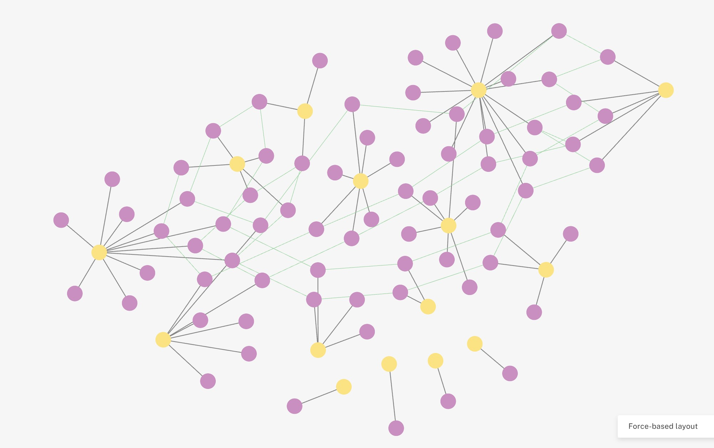

# BNNHanPOC
BNN - HAN: Hierarchical Self-Attention Network Proof-of-Concept/Demo

## BNN  - HAN Architecture & Pipeline

## PyTorch HeteroData - BNNHDataSet

HeteroData based on BNN Model topology as introduced in [BNN-MODEL-BUILDER](https://github.com/trezbit/bnn-model-builder)

## Runtime Env and Dependencies

*Tested on*: Ubuntu 22.04 - *Python Version*: 3.10.12 

*Requires:* 

- Python version 3.10 or greater 
- Pytorch 

## Utilities

Command-line options/settings are available for testing various BNN HAN POC demo and DataSet utilities

> python demo.py -h
> usage: demo.py [-h] {demo,build} ...
> BNN HAN Model POC Demo Utilities
> 
> positional arguments:
>   {demo,build}
>     demo        BRAINGNNet POC/demos
>     build       BNNHDS Hetero DataSet build utilities
> 
> options:
>   -h, --help    show this help message and exit
>   -h, --help    show this help message and exit

## Getting help

If you have questions, concerns, bug reports, etc, please file an issue in this repository's Issue Tracker.

## Open source licensing info

1. [LICENSE](LICENSE)

----

## Credits and References

### EEG Study Datasets

The graph model in this repository was build to assess the effectiveness of a HGNN learner and inference framework aligning the brain topology with the International 10–10 system for EEG electrode placement and Absolute Band Powers as the key EEG feature. 

This model combines Brain Imaging Data Structure (BIDS) compliant datasets from two critical EEG studies:

- **cpCGX-BIDS: Chronic Pain Data EEG Dataset** (Technical University of Munich [Zebhauser])

  - Raw resting-state EEG data [conditions: eyes closed (EC) or eyes open(EO), Electrodes: 29] in BIDS format for 74 chronic pain patients
  - Recorded between March 2022 and November 2022 in the Klinikum Rechts der Isar (Munich, Germany)

  *More At*: https://doi.org/10.1038/s41597-023-02525-0

- **MBB LEMON: Control (Healthy) EEG Dataset** (Max Planck Institut Leipzig [Babayan])

  - Preprocessed resting state EEG data [conditions: eyes closed (EC) or eyes open(EO), Electrodes: 59] in BIDS format for 228 Participants (from which we sampled 92). 
  - Digitized EEG channel locations Polhemus leveraging PATRIOT Motion Tracking System (Polhemus, Colchester, VT, USA) localizer with the Brainstorm toolbox.

  *More At*: https://fcon_1000.projects.nitrc.org/indi/retro/MPI_LEMON.html

### GNN Architecture 

#### PyTorch Geometric
> Fey, M., & Lenssen, J. E. (2019). Fast Graph Representation Learning with PyTorch Geometric. ArXiv. https://arxiv.org/abs/1903.02428

#### Learning from Heterogeneous Graphs

> Labonne, Maxime (2023). Hands-On Graph Neural Networks Using Python: Practical techniques and architectures for building powerful graph and deep learning apps with PyTorch
> https://github.com/PacktPublishing/Hands-On-Graph-Neural-Networks-Using-Python

### Other References

Following resources were referenced in implementing this demo:

> X. Fu, J. Zhang, Z. Meng, and I. King. MAGNN: Metapath Aggregated Graph Neural Network for Heterogeneous Graph Embedding. Apr. 2020. DOI: 10.1145/3366423.3380297. https://arxiv.org/abs/2002.01680.
> J. Liu, Y. Wang, S. Xiang, and C. Pan. HAN: An Efficient Hierarchical Self-Attention Network for Skeleton-Based Gesture Recognition. arXiv, 2021. DOI: 10.48550/ARXIV.2106.13391. https://arxiv.org/abs/2106.13391.

   
