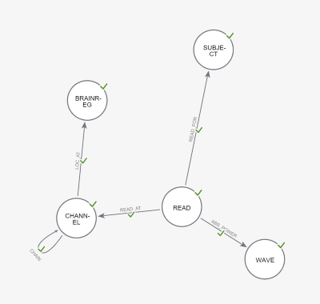

# BNN-Han-POC
BNN - HAN: Heterogeneous graph attention Network Proof-of-Concept - Demo

OSF Project: https://osf.io/z63jw/?view_only=d68a9e47582b44ccb816c29dcf206e5e

Background: [EEG-Pain-BioMarker.discovery-graph-model-article.pdf](./docs/EEG-Pain-BioMarker.discovery-graph-model-article.pdf)

## BNN  - HAN Architecture & Model Processing Pipeline

This POC project evaluates the feasibility of using Heterogeneous Graph Attention Networks (HAN) to address the complexities of EEG signal analysis and to improve the accuracy of GNN used for chronic pain detection. The implementation expands to HAN's message-passing and attention mechanisms for a binary classification task: distinguishing chronic pain states from control (no pain) conditions. 

The POC employs two public datasets: cpCGX-BIDS (chronic pain) and MBB LEMON (control) for training the GNN model, adopts a two-tiered self-attention architecture, and implements a prediction module leveraging node and semantic level aggregators and meta-path strategies borrowing from [1: Wang, X, et.al]. 


As explored in the parent OSF project:  [BRAINGNNet: Exploring Graph Models for Chronic Pain Detection through EEG Biomarkers](https://osf.io/pfx32/), by transforming EEG channel readings into graph representations, the approach simplifies predictive modeling, enabling the learner to identify pain dissipation patterns and pathways across the brain topology. The proposed approach captures Absolute Band Power (ABP) activation patterns across neural regions, emphasizing an optimally expressive graph structure to represent the brain activity of the study participants.


## PyTorch HeteroData - BNNHDataSet

|                      BNN Graph DB Model                      |                        BNN HAN Model                         |
| :----------------------------------------------------------: | :----------------------------------------------------------: |
|  |  |

A custom Heterogenous [PyTorch DataSet](./model/dataset.py): `BNNHDataSet` has been created  based on Neo4J Graph Database - BNN Model topology introduced in [BNN-MODEL-BUILDER](https://github.com/trezbit/bnn-model-builder), with following adjustments:

1. As part of feature engineering, for robust scaling and normalization of the discriminative ABP thresholds, calibrated the computed reads  for the study common channels using statistical measures of center and spread (Median + Standard Deviation) 
2. For improved GNN efficiency, compressed the original heterogenous graph model to capture three Node types and 2 edges with emphasis on the normalized and scaled node features from (1), eliminating insignificant ABP edges below the thresholds in the process.
3. Created random train, test and validate sets for the demo purposes.

Given the small size of the data set, the demo version leverages the raw data files within this repo, and bypasses the download process. 

*RAW DATA available for download at OSF for download: https://osf.io/ge27r/*

## Runtime Env and Dependencies

*Tested on*: Ubuntu 22.04 - *Python Version*: 3.10.12 

*Requires:* 

- Python version 3.10 or greater 
- Pytorch 

## Utilities

Command-line options/settings are available for testing various BNN HAN POC demo and DataSet utilities

`python demo.py -h`

> usage: demo.py [-h] {demo,build} ...
> BNN HAN Model POC Demo Utilities

> positional arguments:
> {demo,build}
>  demo        BRAINGNNet POC/demos
>  build       BNNHDS Hetero DataSet build utilities
> 
>   options:
>    -h, --help    show this help message and exit

*Running the base demo*

`python demo.py demo --base`

```
PyTorch Geometry POC demos with BNNHDataSet: {}
Bypassed Downloading the dataset -- Using raw files @ GitHub Repo
/home/zeyno/workspace-wsl/bnn-poc-demo/bnn-han-poc/.venv/lib/python3.10/site-packages/torch_geometric/edge_index.py:863: UserWarning: Sparse CSR tensor support is in beta state. If you miss a functionality in the sparse tensor support, please submit a feature request to https://github.com/pytorch/pytorch/issues. (Triggered internally at ../aten/src/ATen/SparseCsrTensorImpl.cpp:53.)
  return torch.sparse_csr_tensor(
---------------------------------------- 

Epoch: 000, Loss: 2.0134, Train: 0.5845, Val: 0.2500, Test: 0.4375
Epoch: 020, Loss: 0.6253, Train: 0.7535, Val: 0.5000, Test: 0.5625
Epoch: 040, Loss: 0.6201, Train: 0.8239, Val: 0.8750, Test: 0.6875
Epoch: 060, Loss: 0.5318, Train: 0.8451, Val: 0.7500, Test: 0.5625
Epoch: 080, Loss: 0.3640, Train: 0.8803, Val: 0.8750, Test: 0.5625
Epoch: 100, Loss: 0.4007, Train: 0.9014, Val: 0.8750, Test: 0.6875
Epoch: 120, Loss: 0.3281, Train: 0.9014, Val: 0.7500, Test: 0.6875
Epoch: 140, Loss: 0.3865, Train: 0.8944, Val: 0.8750, Test: 0.7500
Epoch: 160, Loss: 0.4467, Train: 0.9155, Val: 0.8750, Test: 0.8125
Epoch: 180, Loss: 0.3310, Train: 0.9155, Val: 0.8750, Test: 0.8125
Test accuracy: 81.25%
---------------------------------------- 

              precision    recall  f1-score   support

Chronic-Pain     0.8000    0.8889    0.8421         9
     Control     0.8333    0.7143    0.7692         7

    accuracy                         0.8125        16
   macro avg     0.8167    0.8016    0.8057        16
weighted avg     0.8146    0.8125    0.8102        16

---------------------------------------- 
```


*Viewing the Custom HeteroData BNNHDataSet:*

`python demo.py build --show`

```
PyTorch Geometry BNNHDataSet dataset build utils: {}
Bypassed Downloading the dataset -- Using raw files @ GitHub Repo
BNNHDataSet: HeteroData(
  SUBJECT={
     x=[166, 1],
     y=[166],
     train_mask=[166],
     test_mask=[166],
     val_mask=[166],
   },
   READ_LOC={ x=[8727, 19] },
   WAVE_ABP={ x=[19274, 2] },
  (SUBJECT, HAS_READ, READ_LOC)={ edge_index=[2, 8727] },
  (READ_LOC, HAS_ABP, WAVE_ABP)={ edge_index=[2, 19274] },
  (READ_LOC, rev_HAS_READ, SUBJECT)={ edge_index=[2, 8727] },
  (WAVE_ABP, rev_HAS_ABP, READ_LOC)={ edge_index=[2, 19274] }
)

End of demo session... build
```

## Getting help

If you have questions, concerns, bug reports, etc, please file an issue in this repository's Issue Tracker.

## Open source licensing info

1. [LICENSE](LICENSE)

----

## Credits and References

### EEG Study Datasets

The graph model in this repository was build to assess the effectiveness of a HGNN learner and inference framework aligning the brain topology with the International 10–10 system for EEG electrode placement and Absolute Band Powers as the key EEG feature. 

This model combines Brain Imaging Data Structure (BIDS) compliant datasets from two critical EEG studies:

- **cpCGX-BIDS: Chronic Pain Data EEG Dataset** (Technical University of Munich [Zebhauser])

  - Raw resting-state EEG data [conditions: eyes closed (EC) or eyes open(EO), Electrodes: 29] in BIDS format for 74 chronic pain patients
  - Recorded between March 2022 and November 2022 in the Klinikum Rechts der Isar (Munich, Germany)

  *More At*: https://doi.org/10.1038/s41597-023-02525-0

- **MBB LEMON: Control (Healthy) EEG Dataset** (Max Planck Institut Leipzig [Babayan])

  - Preprocessed resting state EEG data [conditions: eyes closed (EC) or eyes open(EO), Electrodes: 59] in BIDS format for 228 Participants (from which we sampled 92). 
  - Digitized EEG channel locations Polhemus leveraging PATRIOT Motion Tracking System (Polhemus, Colchester, VT, USA) localizer with the Brainstorm toolbox.

  *More At*: https://fcon_1000.projects.nitrc.org/indi/retro/MPI_LEMON.html

### GNN Architecture 

#### PyTorch Geometric
> Fey, M., & Lenssen, J. E. (2019). Fast Graph Representation Learning with PyTorch Geometric. ArXiv. https://arxiv.org/abs/1903.02428

#### Learning from Heterogeneous Graphs

> Labonne, Maxime (2023). Hands-On Graph Neural Networks Using Python: Practical techniques and architectures for building powerful graph and deep learning apps with PyTorch
> https://github.com/PacktPublishing/Hands-On-Graph-Neural-Networks-Using-Python

### Other References

The following resources were referenced in implementing this demo:

> [1] Xiao Wang, Houye Ji, Chuan Shi, Bai Wang, Yanfang Ye, Peng Cui, and Philip S Yu. Heterogeneous Graph Attention Network. 2019. https://par.nsf.gov/servlets/purl/10135600,
>
> [2] X. Fu, J. Zhang, Z. Meng, and I. King. MAGNN: Metapath Aggregated Graph Neural Network for Heterogeneous Graph Embedding. Apr. 2020. DOI: 10.1145/3366423.3380297. https://arxiv.org/abs/2002.01680.
>
> 

   
